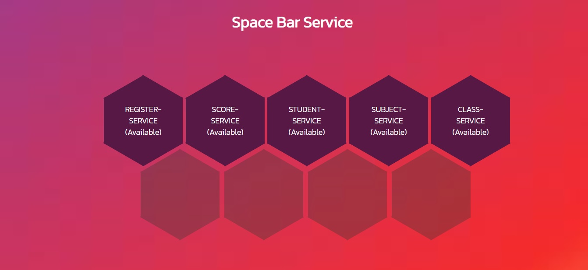

# Dashboard (registered with Eureka)

## Services

- CLASS-SERVICE
- REGISTER-SERVICE
- SCORE-SERVICE
- STUDENT-SERVICE
- SUBJECT-SERVICE

## How to run system

<ol>
    <li>download all file and folder</li>
    <li>import projects in Eclipse IDE</li>
    <li>run project "service-registration-and-discovery-service"</li>
    <li>run projects "service-discovery-client1" - "service-discovery-client5"</li>
    <li>open dashboard.html for view all services</li>
</ol>
