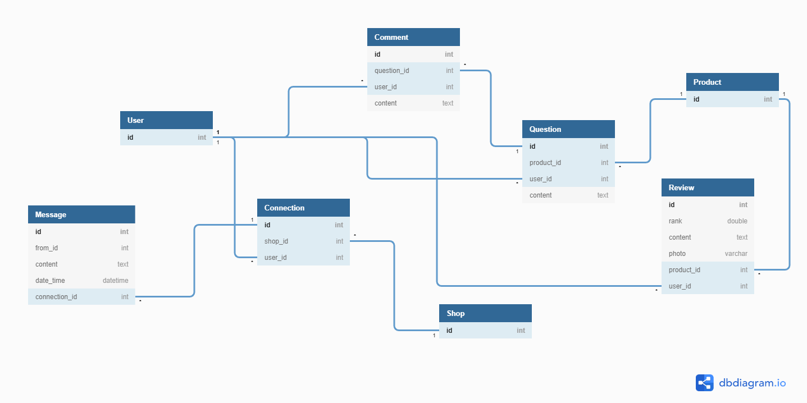

# Module CRM (E-Commerce)

เป็นส่วนที่จัดการเกี่ยวกับการรักษาความสัมพันธ์กับลูกค้า (เพื่อให้การติดต่อกันระหว่างร้านค้ากับลูกค้าได้สะดวกมากยิ่งขึ้น) โดยจะมีระบบหรือหน้าย่อยๆ ดังนี้

<ul>
    <li>การรีวิวสินค้า (Review)</li>
    <li>การให้ลูกค้าหรือ user สอบถามเกี่ยวกับสินค้านั้นๆ (Question)</li>
    <li>message ติดต่อกันระหว่างลูกค้ากับร้านค้านั้นๆ (Messaging)</li>
</ul>

# Solution by.Head

Note : Task All CRM module use React App.

<ul>
    <li>ออกแบบไวเฟรมหน้า รีวิว, คำถามเกี่ยวกับสินค้านั้นๆ, message ติดต่อกันระหว่าง ลูกค้ากับร้านค้านั้นๆ โดยหน้ารีวิว และ หน้าคำถามเกี่ยวกับสินค้านั้นๆ ซึ่งจะอยู่ในหน้าเดียวกันกับหน้าสินค้าสินค้านึง</li>
    <li>ลง code สร้าง frontend โดยใช้ HTML+CSS สร้างให้เหมือนกับไวเฟรมที่ออกแบบให้มากที่สุด ทั้ง 2 หน้า</li>
    <li>นำ HTML ไฟล์ไปลงในโปรเจค React App (Web App)</li>
    <li>ทำ backend โดยใช้ React App เชื่อมกับ DataBase (ดึงข้อมูลใน database มาแสดงบนหน้าเว็บให้ได้)</li>
    <li>จัดการเกี่ยวกับข้อมูลหลังดึงข้อมูลมาจาก DataBase แล้ว นำมาทำการ loop, mapping ต่างๆ</li>
</ul>

# CRM Services

<ul>
    <li>การรีวิวสินค้าจากลูกค้าที่ซื้อสินค้านั้นๆ (Create Review)</li>
    <li>การติดต่อกันระหว่างลูกค้ากับเจ้าของร้าน (Create Messenger)</li>
    <li>การสอบถามเกี่ยวกับสินค้านั้นๆ (Create Question)</li>
    <li>การตอบกลับของร้านค้าหรือลูกค้าที่มีการสอบถามเกี่ยวกับสินค้านั้นๆ (Create Comment)</li>
</ul>

# CRM Database (Logical Design)

# Members and tasks received

<ol>
    <li>นายพันธกานต์ แก้วสังหาร (61070139 - Head)</li>
    <ul>
        <li>ทำ backend โดยใช้ React App เชื่อมกับ DataBase (ดึงข้อมูลใน database มาแสดงบนหน้าเว็บให้ได้)</li>
        <li>จัดการเกี่ยวกับข้อมูลหลังดึงข้อมูลมาจาก DataBase แล้ว นำมาทำการ loop, mapping ต่างๆ</li>
    </ul>
    <li>นายพันธวีร์ คงสวัสดิ์ (61070140)</li>
    <ul>
        <li>ออกแบบไวเฟรมหน้า รีวิว, คำถามเกี่ยวกับสินค้านั้นๆ, message ติดต่อกันระหว่าง ลูกค้ากับร้านค้านั้นๆ โดยหน้ารีวิว และ หน้าคำถามเกี่ยวกับสินค้านั้นๆ ซึ่งจะอยู่ในหน้าเดียวกันกับหน้าสินค้าสินค้านึง</li>
        <li>ลง code สร้าง frontend โดยใช้ HTML+CSS สร้างให้เหมือนกับไวเฟรมที่ออกแบบให้มากที่สุด</li>
    </ul>
    <li>นายนนททรัพย์ เซี่ยงฉิน (61070095)</li>
     <ul>
         <li>ลง code สร้าง frontend โดยใช้ HTML+CSS สร้างให้เหมือนกับไวเฟรมที่ออกแบบให้มากที่สุด</li>
     </ul>
    <li>นายพัชรพล บุญชุ่ม (61070136)</li>
    <ul>
        <li>ทำ backend โดยใช้ React App เชื่อมกับ DataBase (ดึงข้อมูลใน database มาแสดงบนหน้าเว็บให้ได้)</li>
        <li>จัดการเกี่ยวกับข้อมูลหลังดึงข้อมูลมาจาก DataBase แล้ว นำมาทำการ loop, mapping ต่างๆ</li>
    </ul>
    <li>นายสิรภพ รักเกื้อ (61070241)</li>
    <ul>
        <li>ออกแบบไวเฟรมหน้า รีวิว, คำถามเกี่ยวกับสินค้านั้นๆ, message ติดต่อกันระหว่าง ลูกค้ากับร้านค้านั้นๆ โดยหน้ารีวิว และ หน้าคำถามเกี่ยวกับสินค้านั้นๆ ซึ่งจะอยู่ในหน้าเดียวกันกับหน้าสินค้าสินค้านึง</li>
        <li>ลง code สร้าง frontend โดยใช้ HTML+CSS สร้างให้เหมือนกับไวเฟรมที่ออกแบบให้มากที่สุด</li>
    </ul>
</ol>
